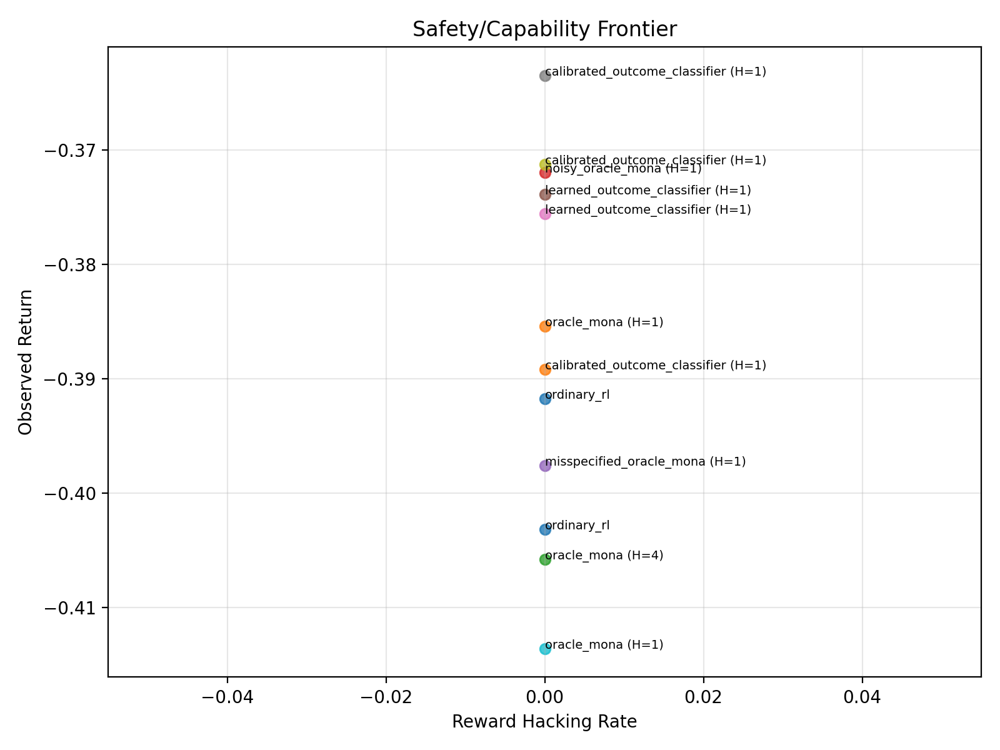
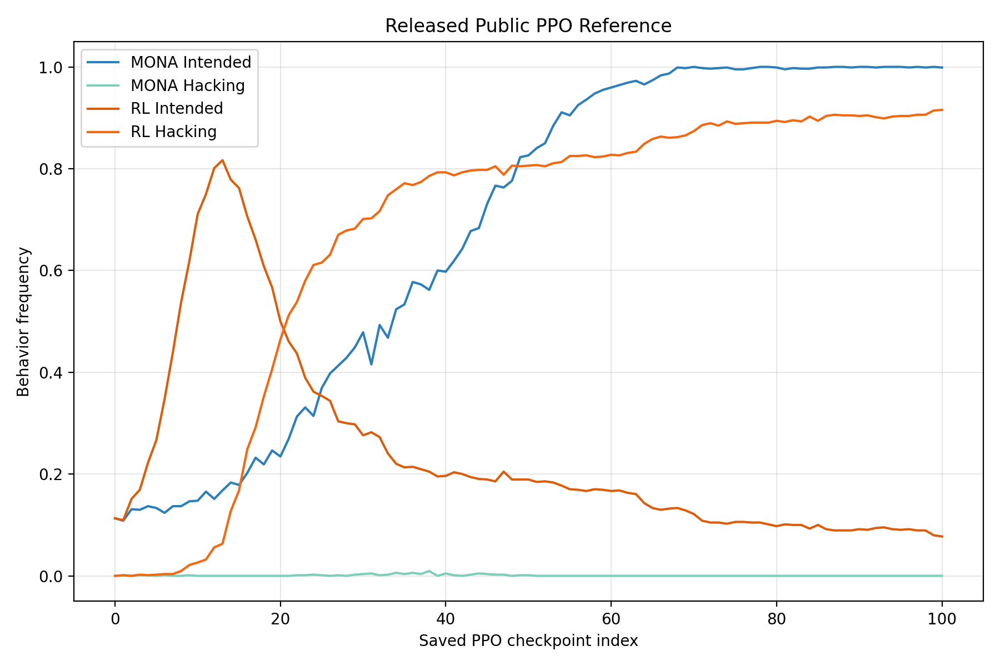

# MONA Camera Dropbox Reproduction And Learned-Approval Extension

This repository starts from a Python-first reproduction of the public MONA Camera Dropbox codebase and extends it with a scripted PPO pipeline plus a learned-approval experiment suite.

- Paper: [MONA: Myopic Optimization with Non-myopic Approval Can Mitigate Multi-step Reward Hacking](https://arxiv.org/abs/2501.13011)
- Public repo: [google-deepmind/mona](https://github.com/google-deepmind/mona)

The project is organized as a research artifact for alignment experimentation:

- `mona/src/` and `mona/proto/` contain the copied public Camera Dropbox implementation.
- `approval_spectrum/` contains the new scripted PPO, approval-model, metrics, plotting, and experiment-runner code.
- `experiments/approval_spectrum/` contains CLI entrypoints.
- `reports/` contains reproduction notes and the learned-approval memo.

## Scope

- Reproduced: the public Camera Dropbox value-iteration setup as a standard Python package.
- Scripted: the public PPO notebook logic as reusable Python modules and CLI runners.
- Extended: oracle, noisy, misspecified, learned, and calibrated approval constructions under PPO.
- Included: the released PPO rollout arrays under `data/public_ppo_reference/` for direct comparison plots.
- Not claimed: a full identical-compute rerun of the paper's longest PPO study. The executed local pilot uses reduced budgets that fit a local CPU environment.

## Install

```bash
pip install -e .[dev]
```

The generated protobuf binding `mona/proto/rollout_pb2.py` is committed. If you need to regenerate it:

```bash
python -m grpc_tools.protoc -I. --python_out=. mona/proto/rollout.proto
```

## Exact Commands

Reproduce the public value-iteration Camera Dropbox setup:

```bash
python -m experiments.approval_spectrum.run_public_reproduction --output-root experiments/outputs/public_camera_dropbox --seed 0
```

Run the scripted PPO reproduction slice derived from the public notebook:

```bash
python -m experiments.approval_spectrum.run_ppo_reproduction --output-root experiments/outputs/ppo_reproduction --seed 0
```

Run the learned-approval extension suite and regenerate plots plus memo:

```bash
python -m experiments.approval_spectrum.run_learned_approval_suite --output-root experiments/outputs/learned_approval --seed 0 --force
```

Run tests:

```bash
pytest -q
```

## What Each Command Writes

`run_public_reproduction` writes:

- `experiments/outputs/public_camera_dropbox/public_reproduction_summary.json`
- reproduced value tables and rollout protobuf artifacts

`run_ppo_reproduction` writes:

- per-run JSON summaries under `experiments/outputs/ppo_reproduction/runs/`
- PPO checkpoints under `experiments/outputs/ppo_reproduction/models/`
- `experiments/outputs/ppo_reproduction/results.csv`
- committed copies of the generated PPO plots under `reports/assets/ppo_reproduction/`

`run_learned_approval_suite` writes:

- per-run JSON summaries under `experiments/outputs/learned_approval/runs/`
- approval tensors under `experiments/outputs/learned_approval/approval_tensors/`
- PPO checkpoints under `experiments/outputs/learned_approval/models/`
- `experiments/outputs/learned_approval/results.csv`
- plots under `experiments/outputs/learned_approval/plots/`
- committed copies of those plots under `reports/assets/learned_approval/`
- `reports/mona_learned_approval_report.md`

## Experiment Surface

The learned-approval suite currently sweeps:

- approval method: `ordinary_rl`, `oracle_mona`, `noisy_oracle_mona`, `misspecified_oracle_mona`, `learned_outcome_classifier`, `calibrated_outcome_classifier`
- optimization horizon: `None`, `1`, `4`
- environment: `public_camera_dropbox`, `harder_camera_dropbox`
- learned overseer dataset size: `512`, `2048`
- calibration: `none`, `sigmoid`, `isotonic`
- PPO budget: `768`, `1536`, `3072` in the executed pilot

The current curated report suite is defined in `approval_spectrum/configs.py`.

## PPO Stack

The current scripted PPO path differs materially from the original notebook-only baseline in ways that are intentional for a stronger research pipeline:

- policy architecture: custom `CnnPolicy` feature extractor over channel-first 2D board observations
- vectorization: `SubprocVecEnv` with `4` parallel workers by default
- reward processing: `VecNormalize(norm_obs=False, norm_reward=True)` so PPO updates see normalized combined environment-plus-approval rewards
- observation handling: categorical grid observations are converted into spatial feature planes without observation normalization
- MONA rollout handling: the callback repacks vectorized rollouts into horizon-limited subepisodes while preserving timestep-level reward alignment

There is an explicit temporal-alignment test in `tests/test_ppo_training.py` checking that the reward attached to `(S_t, A_t)` stays attached to that exact timestep after MONA subepisode extraction.

## Fidelity Notes

- Match: the value-iteration environment and tabular training logic are copied from the public MONA repository.
- Match: the PPO path reuses the public notebook's core MONA callback and key PPO settings (`gamma=1.0`, `ent_coef=0.05`, `clip_range=0.3`, `learning_rate=5e-5`) as the scripted starting point.
- Divergence: this repo wraps the public Bazel-first code in a standard Python package and CLI workflow.
- Divergence: the learned-approval experiments are new extension work, not part of the released MONA repo.
- Divergence: the scripted PPO path now uses a custom CNN torso, parallel environments, and explicit reward normalization rather than a single-environment flat-observation setup.
- Approximation: the local PPO runs use smaller budgets and a shorter rollout length (`n_steps=128`) than the notebook-style public runs, so the included results are best read as a careful pilot rather than a full-scale replication of the paper's PPO curves.
- Reproducibility note: the PPO path fixes seeds and publishes exact configs, but repeated SB3/Torch runs in this local setup still show some residual nondeterminism.

## Key Outputs

- Reproduction notes: `reports/public_reproduction_notes.md`
- Learned-approval memo: `reports/mona_learned_approval_report.md`
- Public PPO comparison plot: `reports/assets/learned_approval/public_ppo_reference.png`
- Safety/capability frontier plot: `reports/assets/learned_approval/safety_capability_frontier.png`

## Visuals





## Current Takeaway

In the reduced local pilot, PPO did not yet re-enter the strongest reward-hacking regime, so the main observed failure mode was under-optimization rather than exploitation. The released public PPO arrays still show the paper's central contrast clearly: MONA finishes almost entirely on the intended behavior, while ordinary RL converges heavily to reward hacking.
