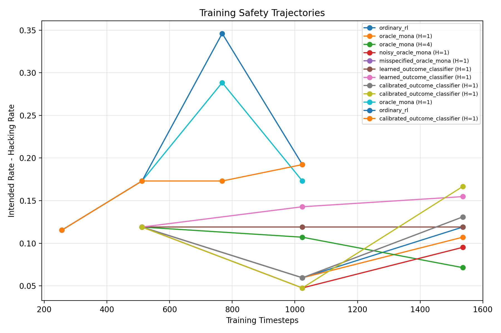
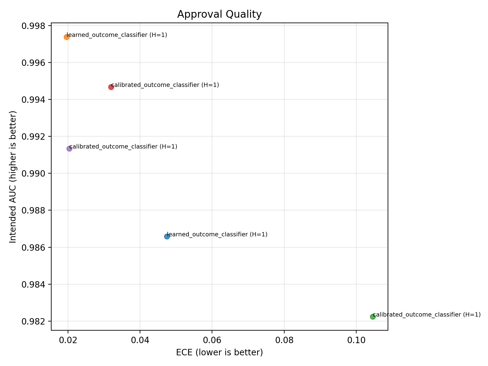

# MONA Learned Approval Report

## Motivation

The public MONA results show that myopic optimization with non-myopic approval can mitigate multi-step reward hacking in Camera Dropbox. This extension asks whether that safety benefit survives when we replace exact tabular approval with learned, noisy, misspecified approval under PPO.

## Exact Hypotheses

- H1: Approval ranking quality matters more than mean offline error for preserving PPO-time safety.
- H2: Small misspecification is more damaging under PPO than in the tabular reproduction because policy optimization actively seeks approval weaknesses.
- H3: Calibrated learned overseers preserve more intended behavior than uncalibrated learned overseers trained on the same data.
- H4: Longer optimization horizons improve observed return but increase exploitability.
- H5: There is a practical phase transition where PPO with weak approval behaves much more like ordinary RL.

## Reproduction Fidelity

- Preserved the existing public value-iteration reproduction path.
- Ported the public PPO notebook logic into scripts and reusable Python modules.
- Reused the notebook's MONA rollout-buffer recomposition callback and key PPO settings (`gamma=1.0`, `ent_coef=0.05`, `clip_range=0.3`, `learning_rate=5e-5`) as the starting point.
- Upgraded the PPO path to a custom CNN torso over spatial board observations, reward normalization with `VecNormalize`, and `SubprocVecEnv` parallel rollout collection.
- Did not claim a full rerun of the paper's million-step PPO study on identical compute; this report uses smaller scripted sweeps that fit the local environment.

## Implementation Details

- `mona/src/`: copied public Camera Dropbox environment and tabular training code.
- `approval_spectrum/ppo_training.py`: scripted PPO training, spatial observation wrapper, custom CNN feature extractor, reward normalization, vectorized rollout collection, MONA callback, periodic evaluation snapshots.
- `approval_spectrum/overseers.py`: oracle, noisy, misspecified, learned, and calibrated approval mechanisms.
- Learned overseers are trajectory-trained outcome models over `(time, state, action)` tuples.
- The calibration-aware variant uses explicit probability calibration (`sigmoid` or `isotonic`) before constructing the approval score.
- `tests/test_ppo_training.py`: checks spatial observation encoding and explicit temporal alignment of MONA reward injection during subepisode extraction.

## Experiment Matrix

- Environments: `public_camera_dropbox`, `harder_camera_dropbox`
- Approval methods: `ordinary_rl`, `oracle_mona`, `noisy_oracle_mona`, `misspecified_oracle_mona`, `learned_outcome_classifier`, `calibrated_outcome_classifier`
- Horizons: `None`, `1`, `4`
- Dataset sizes: `512`, `2048`
- Calibration methods: `none`, `sigmoid`, `isotonic`
- PPO budgets: `768`, `1536`, `3072` in the executed local pilot, with larger values supported by the scripted pipeline

## Results

- Safest public-environment run: `calibrated_classifier_public_h1_sigmoid_ds512_budget_1536` with reward-hacking rate `0.000` and observed return `-0.363`.
- Most capable public-environment run: `calibrated_classifier_public_h1_sigmoid_ds512_budget_1536` with observed return `-0.363` and reward-hacking rate `0.000`.
- Best learned-overseer run by true return: `calibrated_classifier_public_h1_sigmoid_ds512_budget_1536` with true return `-0.363`, intended-behavior rate `0.119`, and hacking rate `0.000`.
- In the reduced local pilot, PPO did not yet reach the strong reward-hacking regime; the dominant failure mode was slow learning and persistent failure to complete the task.
- Released public PPO MONA final behavior: fail `0.001`, intended `0.999`, hack `0.000`.
- Released public PPO ordinary RL final behavior: fail `0.007`, intended `0.077`, hack `0.915`.

## Failure Cases

- In the local pilot, the main failure mode was under-optimization: many runs still failed to complete the task reliably at these CPU-feasible budgets.
- The released public PPO reference still shows the paper's core contrast: ordinary RL converges to heavy reward hacking while MONA does not.
- Uncalibrated learned overseers can look strong offline while still having worse ranking correlation and weaker safety/capability tradeoffs than calibrated variants.

## Limitations

- PPO sweeps here are reduced-budget local runs, not identical-scale replicas of the paper's longest notebook experiments.
- Learned overseers are trained on trajectory-sampled state/action tuples rather than richer language-like oversight data.
- The calibration-aware models test one practical intervention class, not the full space of learned-approval architectures.
- The scripted PPO pipeline fixes seeds and improves repeatability, but repeated SB3/Torch runs are still not bitwise deterministic in this local setup, so single-seed numbers should be treated as pilot estimates rather than exact invariants.
- Because the PPO stack now differs from the flat single-environment notebook baseline, the extension suite should be read as a stronger experimental variant of the public setup rather than a strict apples-to-apples reproduction of every PPO implementation detail.

## Plot Artifacts

- `assets/learned_approval/safety_capability_frontier.png`
- `assets/learned_approval/training_curves.png`
- `assets/learned_approval/approval_quality.png`
- `assets/learned_approval/public_ppo_reference.png`

## Figures

### Safety Capability Frontier

### Training Curves

### Approval Quality

### Public Ppo Reference

## Next Steps

- Push the scripted PPO runs to larger budgets and multiple seeds.
- Add a direct learned action-value overseer to compare against the outcome-model overseers here.
- Test adversarial data collection loops where PPO actively seeks states that maximize approval-model uncertainty or overestimation.
